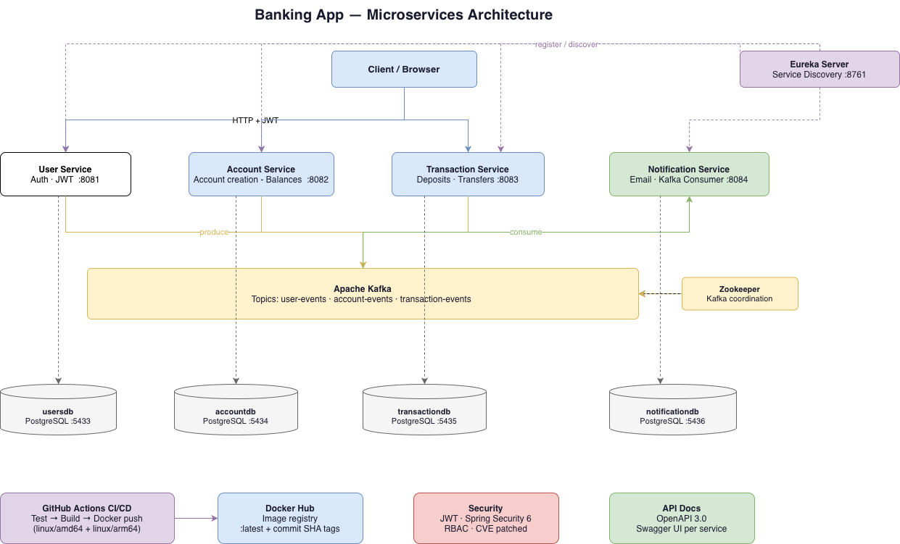

# Banking App

A modular, secure microservices-based banking application built with **Spring Boot 3.5** and **Java 17**, containerized with Docker and deployed via a fully automated GitHub Actions CI/CD pipeline.

## Table of Contents

- [Overview](#overview)
- [Architecture](#architecture)
- [Services](#services)
- [Tech Stack](#tech-stack)
- [Getting Started](#getting-started)
- [Running with Docker Compose](#running-with-docker-compose)
- [Running Services Locally](#running-services-locally)
- [Environment Variables](#environment-variables)
- [API Documentation](#api-documentation)
- [Authentication](#authentication)
- [Kafka & Event Flow](#kafka--event-flow)
- [CI/CD Pipeline](#cicd-pipeline)
- [GitHub Secrets Required](#github-secrets-required)
- [Future Improvements](#future-improvements)

## Overview

This project demonstrates backend engineering patterns including:

- Clean microservices separation with independently deployable services
- JWT-based authentication and role-based access control (RBAC)
- Asynchronous event-driven communication via Apache Kafka
- Kafka retry logic, dead letter topics (DLT), and idempotent event processing
- Eureka-based service discovery
- Per-service PostgreSQL databases (database-per-service pattern)
- Multi-architecture Docker builds (amd64 + arm64)
- Full CI/CD with GitHub Actions


## Architecture


## Services

| Service | Port | Responsibility |
|---|---|---|
| **User Service** | `8081` | User registration, login, JWT issuance, profile management |
| **Account Service** | `8082` | Account creation, balance tracking, admin operations |
| **Transaction Service** | `8083` | Deposits, withdrawals, transfers, transaction history |
| **Notification Service** | `8084` | Consumes Kafka events and sends email notifications |
| **Eureka Server** | `8761` | Service discovery and registry |

Each service is independently deployable, Dockerized, and registered with Eureka.


## Tech Stack

**Core**
- Java 17, Spring Boot 3.5, Spring Cloud 2025.0.0
  **Security & Auth**
- Spring Security 6.5.5, JWT (JJWT 0.13.0)
  **Messaging**
- Apache Kafka (Confluent 7.5.0), Spring Kafka
- Retry with exponential backoff, Dead Letter Topics (DLT), idempotent consumers
  **Data**
- Spring Data JPA, Hibernate 6.6.22, PostgreSQL 15
  **Service Discovery**
- Netflix Eureka (Spring Cloud)
  **Build & DevOps**
- Maven, Docker, Docker Buildx (multi-arch), GitHub Actions
  **Documentation**
- OpenAPI 3.0, Springdoc, Swagger UI
  **Utilities**
- Lombok, MapStruct, JaCoCo (code coverage), SLF4J

## Getting Started

### Prerequisites

- Java 17+
- Maven 3.8+
- Docker & Docker Compose
- A running PostgreSQL instance (or use Docker Compose)
- A running Kafka instance (or use Docker Compose)
### Clone the repository

```bash
git clone https://github.com/bhagyahosur18/banking-app.git
cd banking-app
```

## Running with Docker Compose

The easiest way to spin up the full stack locally.

**1. Create a `.env` file** in the project root:

```env
JWT_SECRET=your-super-secret-jwt-key
DB_USER=postgres
DB_PASS=postgres
MAIL_USERNAME=your-email@gmail.com
MAIL_PASSWORD=your-app-password
```

**2. Start everything:**

```bash
docker-compose up --build
```

This starts: Zookeeper, Kafka, Eureka Server, all four microservices, and four PostgreSQL databases — all on a shared `microservices-network`.

**3. Verify services are running:**

| Service | URL |
|---|---|
| Eureka Dashboard | http://localhost:8761 |
| User Service | http://localhost:8081 |
| Account Service | http://localhost:8082 |
| Transaction Service | http://localhost:8083 |
| Notification Service | http://localhost:8084 |

## Running Services Locally

If you prefer to run services individually outside Docker:

```bash
# Start PostgreSQL (Docker)
docker run -d --name postgres-db \
  -e POSTGRES_USER=postgres \
  -e POSTGRES_PASSWORD=postgres \
  -p 5432:5432 postgres:15
 
# Create the required databases
docker exec -it postgres-db psql -U postgres -c "CREATE DATABASE usersdb;"
docker exec -it postgres-db psql -U postgres -c "CREATE DATABASE accountdb;"
docker exec -it postgres-db psql -U postgres -c "CREATE DATABASE transactiondb;"
docker exec -it postgres-db psql -U postgres -c "CREATE DATABASE notificationdb;"
 
# Build all services
mvn clean install -DskipTests
 
# Run individual services
cd user-service && mvn spring-boot:run
cd account-service && mvn spring-boot:run
cd transaction-service && mvn spring-boot:run
cd notification-service && mvn spring-boot:run
```

## Environment Variables

| Variable | Description | Example |
|---|---|---|
| `JWT_SECRET` | Secret key for JWT signing | `my-secret-key-256bit` |
| `DB_USER` | PostgreSQL username | `postgres` |
| `DB_PASS` | PostgreSQL password | `postgres` |
| `SPRING_DATASOURCE_URL` | JDBC connection URL | `jdbc:postgresql://localhost:5432/usersdb` |
| `SPRING_KAFKA_BOOTSTRAP_SERVERS` | Kafka broker address | `kafka:29092` |
| `EUREKA_CLIENT_SERVICE_URL_DEFAULTZONE` | Eureka registry URL | `http://eureka-server:8761/eureka/` |
| `MAIL_USERNAME` | SMTP email address | `your-email@gmail.com` |
| `MAIL_PASSWORD` | SMTP app password | `your-app-password` |

## API Documentation

Swagger UI is available for each service when running:

| Service | Swagger URL |
|---|---|
| User Service | http://localhost:8081/swagger-ui/index.html |
| Account Service | http://localhost:8082/swagger-ui/index.html |
| Transaction Service | http://localhost:8083/swagger-ui/index.html |

## Authentication

JWT tokens are issued by the **User Service** on successful login.

Include the token in all protected requests:

```
Authorization: Bearer <your-jwt-token>
```

- Tokens are validated by each service independently via Spring Security
- Role-based access control (RBAC) restricts admin vs user operations
- All CVE vulnerabilities are patched and regularly reviewed

## Kafka & Event Flow

Services publish events to Kafka topics on significant actions (user created, account updated, transaction processed). The Notification Service consumes these events and sends email notifications.

**Topics:**
- `user-events` — user registration, profile changes
- `account-events` — account creation, status changes
- `transaction-events` — deposits, withdrawals, transfers
  **Reliability features:**
- **Retry with exponential backoff** — failed messages are retried up to 3 times (1s → 2s → 4s)
- **Dead Letter Topic (DLT)** — messages that exhaust retries are routed to `<topic>.DLT` for inspection
- **Idempotent consumers** — duplicate events are detected via `eventId` and safely ignored

## CI/CD Pipeline

Every push to `main` or `develop` triggers the GitHub Actions pipeline.

### Stage 1 — Build & Test (`build-and-test`)

Runs on every push and pull request:

1. Check out code
2. Set up Java 17 with Maven cache
3. Build all Spring Boot services
4. Run unit tests
5. Run integration tests with a PostgreSQL service container
6. Upload test results as artifacts


### Stage 2 — Docker Build & Push (`build-docker-images`)

Runs only after tests pass, and only on `main`:

1. Set up Docker Build for multi-architecture builds
2. Authenticate with Docker Hub
3. Build and push images for all services:
  - `user-service`
  - `account-service`
  - `transaction-service`
  - `notification-service`
  - `eureka-server`
4. Tags: `latest` and git commit SHA
5. Architectures: `linux/amd64` and `linux/arm64`

## GitHub Secrets Required

Configure these in **Settings → Secrets and variables → Actions**:

| Secret | Description |
|---|---|
| `DOCKER_USERNAME` | Docker Hub username |
| `DOCKER_PASSWORD` | Docker Hub password or access token |
| `JWT_SECRET` | JWT signing secret used |

## Future Improvements

- API Gateway (Spring Cloud Gateway) as a single entry point
- Centralized logging with ELK Stack (Elasticsearch, Logback, Kibana)
- Distributed tracing with Zipkin or OpenTelemetry
- Metrics and monitoring with Prometheus + Grafana
- Password reset and email verification flow
- Refresh token support

## License

This project is licensed under the MIT License.